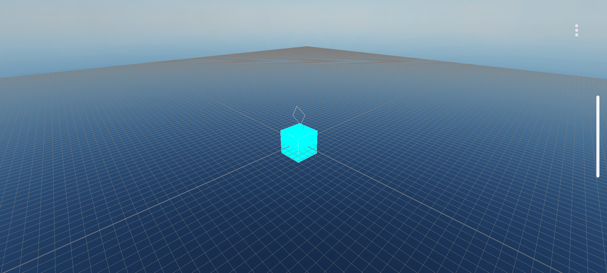
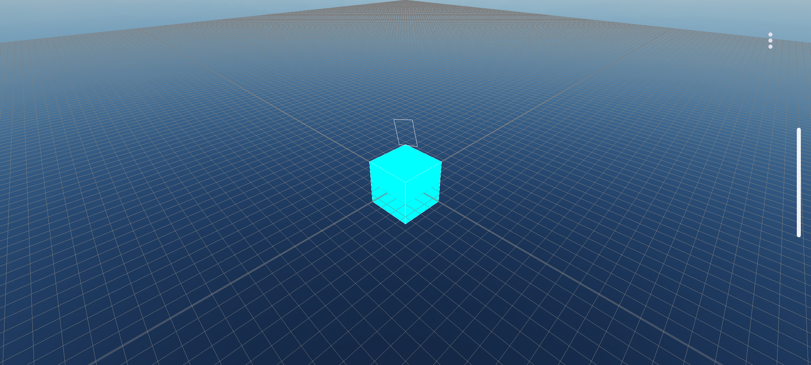
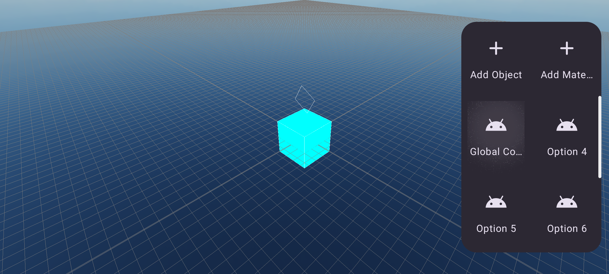

# 🎮 uScene3D

**uScene3D** is a **3D scene editor for game development on Android**.  
It is an experimental and lightweight system designed to help developers **create, visualize, and edit 3D scenes directly on Android devices**, focusing on simplicity, performance, and portability.

This project is especially useful for **mobile game prototyping**, scene layout creation, and learning purposes related to 3D rendering and scene management.

---

## 📸 Screenshots

Below are some screenshots showing the editor interface and features:






---

## 🚀 Features

- 📱 Native **Android-based 3D scene editor**
- 🎮 Designed for **game development workflows**
- 🧱 Scene composition with 3D objects
- 🔄 Object transformation (position, rotation, scale)
- 👁️ Real-time 3D visualization
- ⚡ Lightweight and experimental architecture
- 🧪 Ideal for prototyping and learning 3D concepts

---

## 🛠️ Technologies Used

- **Android SDK**
- **Java / Kotlin**
- **OpenGL ES** (for 3D rendering)
- Custom scene management system

---

## 📦 Project Structure

```text
uScene3D/
├── app/                # Main Android application source
├── screenshots/        # Project screenshots
│   ├── 1.png
│   ├── 2.png
│   ├── 3.png
│   └── 4.png
├── build.gradle        # Gradle build configuration
├── settings.gradle
└── LICENSE
